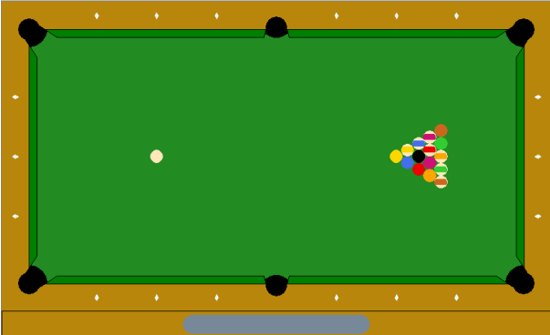

# Einführung

## Aufgabenstellung

>Aufgabe: 
>Erstellen Sie ein initiales Spielfeld wie angegeben. Durch Mouseevents soll zu Spielbeginn die Stoßrichtung und Geschwindigkeit der weißen Kugel vorgegeben werden. Dazu ist mit der Mouse ein Queue anzutragen. Im weiteren Spielverlauf sollen alle Kugeln wie beim klassischen Poolbillard per Queue bewegt werden.  Nutzen Sie die in der Vorlesung gegebenen Grundlagen zur Darstellung und Simulation von Stoßereignissen.  Beachten Sie die unterschiedlichen Bewegungsgleichungen für Kugel/Kugel bzw. Kugel/Banden-Kontakt. Zusätzlich soll 

Billiard ist ein Geschicklichkeitsspiel bei dem Kugeln mit Hilfe eines Stabes, der Queue genannt wird, in Löcher gestossen werden. Dabei werden die 15 farbigen Kugeln nicht direkt mit dem Stab angespielt. Vielmehr spielt man mit dem Queue den weißen Spielball, der dann die anderen  Kugeln so anstossen muss, dass diese in die Löcher fallen. Bei der von uns betrachteten Variante dem Poolbillard muss die schwarze 8 zuletzt eingelocht werden.

## Stoss

Der wichtigste physikalische Vorgang bei der Simulation eines Billardspiels ist der Stoss. Dieser ist das Zusammentreffen zwischen zwei Körpern, bei dem die Kinetische Energie konstant bleibt. Bei der Kollision wird die kinetische Energie zunächst in potentielle Energie umgewandelt. Dies geschieht durch eine Verformung der Körper, welche die gespeicherte Energie dann wieder als kinetische Energie abgeben.

Grundsätzlich lassen sich Stossvorgänge in elastisch und inelastisch einteilen. Beim elastischen Stoss wird die gesamte kinetische Energie bei der Verformung der Körper in potentielle Energie umgewandelt. Beim inelastischen Stoss wird hingegen ein Teil der Energie in andere Energieformen konvertiert -- vor allem Wärme, Schall und die plastische Verformung von einem der Körper.

Im makroskopischen Bereich ist der elastische Stoss nur als Idealisierung zu betrachten, da immer Wärme erzeugt wird. Wirklich elastische Kollisionen sind nur auf der Ebene von Atomen oder Quantenobjekten möglich. Zur Vereinfachung kann man den Verlust von kinetischer Energie vernachlässigen, unter der Voraussetzung, dass er gegenüber der Bewegungsenergie sehr klein ist. Bei der Kollision von zwei Billardkugeln -- welche oft als Beispiel für den elastischen Stoss verwendet wird ist dies der Fall [@Cross_2014].

Im gegensatz zu den Kugeln, welche aus Phenoplast hergestellt werden, besteht der Bandenspiegel um den Tisch herum aus vulkanisierten Elastomeren, welche dazu dienen den Energieverlust des Balles gering zu halten. Je nach den gewählten Materialien unterscheidet sich das Effet verhalten des Balles. In unserem Fall gehen wir von einer harten und dichten Bande aus. Der Stoss kann so als rein elastisch betrachtet werden.

## Rollreibung

Das zweite physikalische Phänomen, welches beim Billardtisch auftaucht ist die Rollreibung der Kugel auf dem Tisch beziehungsweise Tuch. Die Rollreibung lässt sich durch die nachfolgende Gleichung bestimmen.
\begin{align*}
F_R &= c_R \cdot F_N \\
F_R &: \text{Rollwiderstand} \\
F_N &: \text{Normalkraft} \\
c_R &: \text{Rollwiderstandskoeffizient}
\end{align*}
Die Rollreibung entsteht durch die Verformung des Untergrundes durch das rollende Objekt, sowie an durch die Verformung des Objektes selbst. Je weicher der Untergrund oder Objekt desto größer die Verformung und dementsprechend die Reibung.
\begin{figure}
\centering
\begin{tikzpicture}
[
	  > = latex,
    very thick
]

  \draw (0,0.95) circle (1);
  \draw (-2,0) to (-0.35,0);
  \draw (2,0) to (0.35,0);
  \draw[dotted] (-0.35,0) to (0.35,0);
  \draw[thin] (0, -0.3) to (0, 2.3);
  \draw[thin] (0.35, -0.3) to (0.35, 2.3);
  \draw[thick] (-0.35,2.2) to node[above] {$d$} (0.7,2.2);
  \draw[thick,->] (-0.35,2.2) to (0, 2.2);
  \draw[thick,<-] (0.35,2.2) to (0.7, 2.2);
  \draw (0.35,0) to[bend right=20] (0.7,0.2) to[bend left=70] (1.2,0);

  \draw[->] (-1.9, 1.5) to node[above] {$\vec{v}$} (-1.2,1.5);
  \draw[->] (0, 0.95) to node[above] {$R$} (-0.86,1.4);
  \draw[->] (1.5, 0.2) to node[above] {$F_R$} (0.8,0.2);
  \draw[->] (0,0) to node[left] {$F_N$} (0,0.6);
  \draw[->,thick] (0,0.7) arc[start angle=270, end angle=30, radius=0.3];

\end{tikzpicture}
\caption{Schematische Darstellung der Kräfte und Verformungen beim Rollvorgang.}
\end{figure}

Die Verformung des Untergrundes besteht aus einem Einsinken des Körpers und einer Anhäufung von Material vor dem Körper selbst. Dies ist Schematisch in der obigen Skizze dargestellt. Ein Weicherer untergrund führt zu mehr Einsinken und damit auch zu mehr Material in der Bahn des Rollkörpers. Wenn die tiefe des Einsinkens bekannt ist lässt sich hieraus auch der Rollwiderstandskoeffizient zu $c_R  = \frac{d}{R}$ bestimmen. Hierbei ist $d$ die  Strecke zwischen der Rotationsachse des Rollkörpers und der Stelle, an der sich dessen Außenradius mit der weitergedachten Höhe des Untergrundes schneidet. Da beim Billard entscheidend ist, dass die Rollreibung möglichst gering ist, werden Billardtische in der Regel aus Schiefer gefertigt, da dieser Stein besonders spröde ist. Auch Tische mit Holz oder Stahlplatten werden gefertigt. Der Tisch wird dann mit einem Schweren Tuch bespannt

# Grundlagen

In diesem Kapitel werden die physikalischen Gesetzmäßigkeiten die zur Simulation des Spiels nötig sind erklärt, so wie die Schritte die Nötig sind um sie in einer numerischen Simulation einzusetzen.

## Physikalisch

### Geradlinige Bewegung
Bevor es überhaupt zu den in der Einleitung angesprochenen Stössen kommen kann, muss zunächst die geradlinige Bewegung der Kugeln realisiert werden.
Da die Ausgabe als 2D Grafik erfolgt, ist es naheliegend auch ein 2-Dimensionales Koordinatensystem für die Positionen und die Bewegungen der Kugeln zu wählen. Demnach hat jede Kugeln eine Position, eine Geschwindigkeit und eine Beschleunigung als Eigenschaften.

\begin{figure}
\centering
\begin{tikzpicture}
[ very thick,
  > = latex
]
  \coordinate (a) at (1,1);
  \coordinate (v1) at (2.6,3);
  \coordinate (b) at (4,1.8);
  \draw[thick,<->] (0,3) node[above left] {$y$} |- (6,0) node[below] {$x$};
  \draw (a) circle (0.9);
  \draw (b) circle (0.9);
  \draw (a) node[below] {$x_1,y_1$} ;
  \draw (b) node[above] {$x_2,y_2$} ;
  \draw  (a) node[] {\Large +};
  \draw  (b) node[] {\Large +};
  \draw[dashed, ->,thick] (a) to (2.6,3) node[below=1mm] {$v_1$};
  \draw[dashed, ->,thick] (b) to (2.3,0.3) node[right=1mm] {$v_2$};
  \draw[thick,dotted,->] (a) to node[left,near end] {$v_{1x}$} (1,3);
  \draw[thick,dotted,->] (1,3) to node[above] {$v_{1y}$} (v1);
\end{tikzpicture}
\caption{Koordinaten und Geschwin- digkeiten von Kugeln}
\end{figure}

Die aktuelle Position der Kugel lässt sich in x, bzw y Richtung lässt sich also durch $x = v * t + x_0$ berechnen. Da in unserem die einzige wirkende Beschleunigung die konstante Rollreibung ist, lässt sich diese einfach als abnehmende Geschwindigkeit darstellen. Durch die iterative und diskrete Natur von Computerprogrammen macht es Sinn die aktuelle Position $\vec{p}\;$ anhand der zuletzt errechneten zu bestimmen.
$$ \vec{p}_{t} = \vec{p}_{t-1} + \vec{v}_{t} $$
Hier wird dann noch in jedem Iterationsschritt die Geschwindigkeit um den durch die Rollreibung vorgegebenen Faktor verringert. $\vec{v}_t = \vec{v}_{t-1} \cdot (1 - \mu_R) \;$.

### Kollision mit der Bande
Das  

:

# Erklärung der Graphischen Oberfläche

# Ergebnisse und Diskussion

# Zusammenfassung
